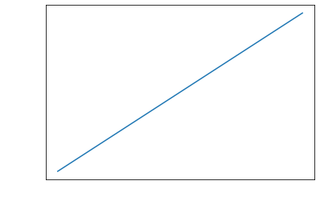

# 새로운 테스트

테스트입니다. .테스트 테스트 ㅇㅇ


```python
import numpy as np
import matplotlib.pyplot as plt

a = 1.5 # a: 상수
x = np.linspace(-1,1) # x: 변수 -1부터 1의 범위1s1
y = a * x # y: 변수


plt.plot(x,y)
plt.xlabel("x",size=14,color='white')
plt.ylabel("y",size=14,color='white')
plt.tick_params(axis='x', colors='white')
plt.tick_params(axis='y', colors='white')
plt.show()
```


    

    


```python

```
